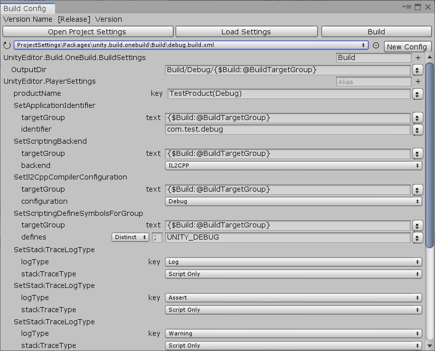

# Unity OneBuild


## manifest.json

```
"system.stringformat": "https://github.com/liuwenjiexx/system.stringformat.git", 
"unity.guiextensions": "https://github.com/liuwenjiexx/Unity.GuiExtensions.git",
"unity.localization": "https://github.com/liuwenjiexx/Unity.Localization.git?path=/Assets/Plugins/Unity.Localization",
"unity.build.onebuild": "https://github.com/liuwenjiexx/Unity.Build.OneBuild.git?path=/Assets/Plugins/Unity.Build.OneBuild",
```


## 预览

**Release**


 



 


#### [文档说明](Assets/Plugins/Unity.Build.OneBuild/README.md)